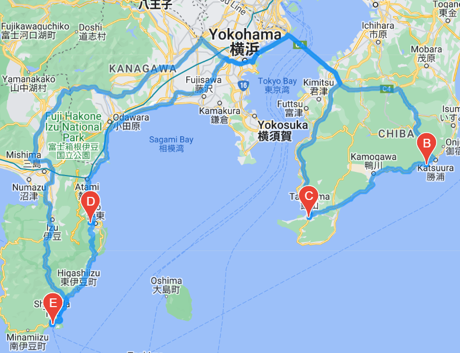

# World_Weather_Analysis

## Purpose

In utilizing the OpenWeatherMap, I was able to perform an API call, generating 2,000 cities current weather standings; i.e., minimum/maximum temperature, longitude/latitude, percent humidity/cloudiness, wind speed, and weather description (fog, light rain, etc.). From there, I inputed my clients temperature preference for the vacation destination, thus relecting a narrowed list of cities with the given temperature. Hotels, cities, countries, and weathers; were achieved in creating a new data frame, encompassing the clients preferances. The client then chose four travel destinations from the list of citites, thus giving way to creating a vacation itenerary. Using the Google Directions API, I drew a travel route amongst each destination with the preferred means of travel being, driving. My client can now see the map of the desired destinations, hotels, temperature, country, and city. 

## Results

### 2,000 Cities with Weather, Country, and City Marked

### Four Selected Travel Destinations with Routes Marked

### Visible Hotel Name, Temperature, Country, and City Marked

## Summary

Client is able to choose desired travel destination and see current weather standings, hotel suggestion, route, city, and country. Narrowing down 2,000 cities by temperature preferance and then location etc., enabled my client to be better prepared for travel.
